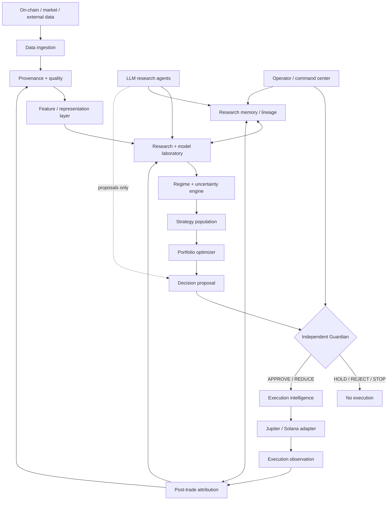
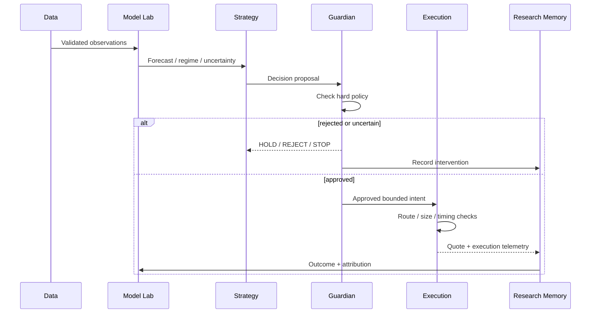
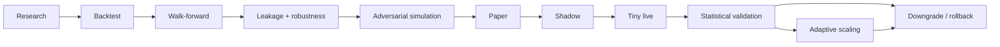

# Advanced AI Trader

**Autonomous, safety-first research and execution platform for spot crypto trading.**

[](https://github.com/Web3AirdropsArena/advenced-ai-trader/actions/workflows/ci.yml?query=branch%3Afoundation)

> **Current status: research-first foundation. Live trading is disabled.**
>
> The system is designed so quantitative code can make proposals, while an independent Guardian decides whether those proposals are allowed to reach execution.

---

## Table of contents

- [What this project is](#what-this-project-is)
- [What it is not](#what-it-is-not)
- [Core design](#core-design)
- [Architecture](#architecture)
- [How one trading decision flows](#how-one-trading-decision-flows)
- [Safety and Guardian](#safety-and-guardian)
- [Data and research](#data-and-research)
- [AI and model laboratory](#ai-and-model-laboratory)
- [Execution and Jupiter](#execution-and-jupiter)
- [Portfolio accounting](#portfolio-accounting)
- [Repository structure](#repository-structure)
- [Configuration](#configuration)
- [Install on Ubuntu](#install-on-ubuntu)
- [Ollama setup](#ollama-setup)
- [Run the application](#run-the-application)
- [API quick tour](#api-quick-tour)
- [Simple code examples](#simple-code-examples)
- [Research-to-live deployment ladder](#research-to-live-deployment-ladder)
- [Operational checklist](#operational-checklist)
- [Testing and CI](#testing-and-ci)
- [Security model](#security-model)
- [Known foundation limits](#known-foundation-limits)
- [Roadmap](#roadmap)
- [Documentation](#documentation)

---

## What this project is

Advanced AI Trader is a local-first autonomous trading research platform built for **spot crypto**, initially targeting **Solana + Jupiter** while keeping the core architecture venue-portable.

The long-term system is intended to combine:

- deterministic quantitative decision engines;
- probabilistic regime inference;
- uncertainty-aware model ensembles;
- adaptive portfolio optimization;
- execution intelligence;
- historical, walk-forward and adversarial simulation;
- autonomous research and experiment generation;
- scientific experiment lineage and reproducibility;
- independent capital-protection policy;
- self-healing infrastructure and disaster recovery;
- a local command center for portfolio, research, models, risk and system state.

The important architectural rule is simple:

> **AI can propose. Policy decides. Execution obeys.**

The LLM layer is a research and engineering accelerator, not a price oracle and not a private-key holder.

---

## What it is not

This repository is **not** currently a plug-and-play money-making bot and it does not claim guaranteed profitability.

The foundation intentionally does **not** provide unrestricted live transaction signing, automatic withdrawals, leverage trading, or uncontrolled self-modification.

A successful backtest is not enough to deploy capital. The intended promotion path is:

```text
research
  -> backtest
  -> walk-forward
  -> leakage tests
  -> stress / adversarial simulation
  -> paper
  -> shadow
  -> tiny_live
  -> statistical validation
  -> adaptive scaling
```

---

## Core design

| Principle | Meaning |
| --- | --- |
| **Guardian first** | Hard loss, drawdown, sizing and uncertainty boundaries are outside the optimizer. |
| **No forced trade** | HOLD / NO_TRADE are valid outcomes. |
| **Spot-only V1** | No live leverage or derivatives in the foundation. |
| **Evidence over narratives** | Models and strategies need lineage and out-of-sample evidence. |
| **Uncertainty-aware** | Model disagreement, data quality and execution uncertainty can reduce or stop exposure. |
| **Small-capital aware** | Fees, slippage, minimum executable size and liquidity matter even at tiny balances. |
| **USDC accounting** | Portfolio value, PnL and risk are normalized to USDC by default. |
| **Venue portability** | Solana/Jupiter is the first execution environment; core research components remain replaceable. |
| **Reproducibility** | Dataset, feature, code, dependency, seed and environment lineage are part of an experiment. |
| **Rollback over heroics** | A degraded model, dependency or service should be downgraded or rolled back rather than forced through. |

---

## Architecture



### Layer-by-layer view

<details>
<summary><strong>1. Data plane — observe before acting</strong></summary>

The data plane collects market and on-chain observations and attaches provenance to them. Raw observations should remain immutable; normalized and derived representations are separate.

The quality layer checks, among other things:

- missing or empty values;
- NaN / infinity;
- timestamp ordering;
- stale observations;
- source reliability;
- duplicate or inconsistent observations;
- temporal alignment and leakage risk;
- cross-source corroboration where available.

A poor-quality observation should increase uncertainty or stop a decision rather than silently becoming a confident feature.

</details>

<details>
<summary><strong>2. Intelligence plane — research and model population</strong></summary>

The intelligence layer is intended to host multiple quantitative families rather than one monolithic model:

- classical statistical / quantitative models;
- Bayesian and state-space models;
- regime models;
- machine-learning and deep-learning models;
- optimization methods;
- ensemble and disagreement estimators;
- future quantum-inspired research where empirical tests justify it.

The model laboratory evaluates candidates out-of-sample and records why candidates were promoted, rejected or retired.

</details>

<details>
<summary><strong>3. Decision plane — combine evidence</strong></summary>

A decision contains an action, confidence, target portfolio fraction, rationale, model version and uncertainty.

The decision is a **proposal**, not an authorization.

```text
BUY / SELL / HOLD / NO_TRADE
          |
          v
 confidence + uncertainty
          |
          v
 regime + liquidity + portfolio state
          |
          v
 execution feasibility
          |
          v
 Guardian policy gate
```

</details>

<details>
<summary><strong>4. Guardian plane — independent capital protection</strong></summary>

The Guardian sits outside strategy generation. It enforces immutable policy boundaries such as:

- maximum portfolio drawdown;
- maximum daily loss;
- maximum position fraction;
- minimum cash reserve;
- minimum confidence;
- maximum uncertainty;
- emergency stop;
- execution safety constraints.

A strategy cannot improve its score by changing these limits.

</details>

<details>
<summary><strong>5. Execution plane — expected outcome is not a fill</strong></summary>

Execution treats a route quote as an observation rather than a guaranteed fill. Future execution intelligence will optimize route, timing, size, slippage and priority costs using realized outcomes.

The current Jupiter adapter is deliberately read-only and does not sign or submit transactions.

</details>

<details>
<summary><strong>6. Research memory — the system remembers why</strong></summary>

Experiment lineage is intended to preserve:

- dataset snapshots;
- feature definitions;
- code revision;
- dependency lock information;
- random seeds;
- environment fingerprints;
- metrics;
- artifacts;
- rejected hypotheses;
- reproducibility hashes;
- model/strategy lineage;
- post-trade attribution.

This becomes the foundation for the planned Asset -> Feature -> Hypothesis -> Model -> Strategy -> Outcome relationship graph.

</details>

---

## How one trading decision flows



The feedback loop is intentionally **evidence-driven**. A bad outcome does not automatically mean “change the model”; it becomes an observation that can trigger attribution, hypothesis testing and controlled retraining.

---

## Safety and Guardian

The current policy defaults are intentionally conservative:

| Control | Foundation default |
| --- | ---: |
| Maximum position fraction | `10%` |
| Maximum portfolio drawdown | `15%` |
| Maximum daily loss | `3%` |
| Minimum cash reserve | `20%` |
| Uncertainty hold threshold | `0.80` |
| Confidence hold threshold | `0.20` |
| Maximum execution slippage | `500 bps` |

These are policy boundaries, not performance targets.

A simplified example of the actual design:

```python
result = guardian.evaluate(
    decision,
    current_drawdown=portfolio.drawdown,
    daily_loss=portfolio.daily_loss,
)

if result.verdict in {GuardianVerdict.APPROVE, GuardianVerdict.REDUCE}:
    execute_only_within(result.allowed_fraction)
else:
    do_not_trade()
```

The Guardian also has a latched emergency stop. Production multi-process deployment must move that latch into a durable, authenticated shared control plane before real-money execution.

---

## Data and research

The research architecture treats data quality as a first-class trading signal.

### Provenance

Every important observation should be traceable to its source and observation/receipt timestamps. Canonicalized payloads can be fingerprinted so changes are detectable.

### Leakage protection

Training and evaluation must respect the decision timestamp. A feature that was only published after the simulated trade time is future information, even if the historical dataset contains it.

### Validation

The intended evaluation stack includes:

1. chronological train/validation/test splits;
2. walk-forward evaluation;
3. multiple market regimes;
4. transaction costs and slippage;
5. liquidity constraints;
6. failed and delayed execution;
7. parameter sensitivity;
8. adversarial stress;
9. unseen-regime simulation;
10. statistical confidence and uncertainty calibration.

### What “success” means

The project does **not** define success as an arbitrary 80% win rate. The meaningful objective is robust risk-adjusted performance across unseen conditions.

Track at least:

- expectancy;
- win rate;
- Sharpe / Sortino;
- Calmar;
- maximum drawdown;
- tail loss;
- turnover;
- fees;
- realized slippage;
- exposure and concentration;
- model disagreement;
- uncertainty calibration;
- regime-specific performance.

---

## AI and model laboratory

The LLM layer is a controlled research population around the quantitative engine.

LLMs may help generate or critique:

- hypotheses;
- feature ideas;
- experiment plans;
- research summaries;
- code changes;
- model alternatives;
- adversarial tests;
- documentation.

The quantitative engine remains authoritative for numerical decisions, and the Guardian remains authoritative for capital policy.

### Local-first Ollama roles

For a 32 GB RAM laptop, use models sequentially rather than keeping every large model resident.

Recommended roles:

| Role | Example local model | Purpose |
| --- | --- | --- |
| Primary reasoning | `gpt-oss:20b` | research, planning, critique |
| Mathematical critic | `deepseek-r1:7b` | math-heavy review and alternative reasoning |
| Fast worker | `qwen3:4b` | classification, summaries, lightweight agents |
| Coding specialist | `qwen3-coder:30b` | deep repository/code tasks, on demand |

Example:

```bash
ollama pull gpt-oss:20b
ollama pull deepseek-r1:7b
ollama pull qwen3:4b
# Optional, on demand:
ollama pull qwen3-coder:30b
```

Do not treat any local LLM as a market oracle. Its job is to expand the research search space while the deterministic/probabilistic trading stack tests what survives.

---

## Execution and Jupiter

The first venue is **Solana + Jupiter**.

The adapter currently targets Jupiter Swap V2's order flow for quote construction. It:

1. validates the order intent;
2. requires the Jupiter API key;
3. requests a route/order observation;
4. validates required response fields;
5. fingerprints the raw response;
6. returns a structured execution quote;
7. retries bounded transient failures.

The current adapter **does not sign or submit transactions**.

```python
quote = await jupiter.quote(order_intent)

print(quote.expected_output_atomic)
print(quote.route_summary)
print(quote.raw_fingerprint)
```

A quote is not a fill. Production execution must record expected versus realized output, fees, slippage, latency and failure modes.

---

## Portfolio accounting

**USDC is the canonical accounting currency.**

```text
BASE_ACCOUNTING_MINT = USDC
BASE_STABLE_MINT     = USDC
SOL_MINT             = WSOL
```

This separation matters. If SOL is held or traded, SOL/USD movement should not automatically be interpreted as strategy alpha. Portfolio value, PnL, drawdown and risk budgets are therefore normalized to the accounting unit.

The same architecture can later support other accounting currencies without coupling strategy logic to a specific execution venue.

---

## Repository structure

```text
advenced-ai-trader/
├── app/
│   ├── api.py              # local FastAPI control plane
│   └── cli.py              # local application entry point
├── core/
│   ├── config.py           # validated runtime configuration
│   └── decision.py         # decision + Guardian contracts
├── data/
│   ├── provenance.py       # source/timestamp/fingerprint metadata
│   └── quality_engine.py   # observation quality checks
├── execution/
│   ├── contracts.py        # bounded order/quote contracts
│   ├── jupiter.py          # read-only Jupiter adapter
│   └── safety.py           # execution safety checks
├── intelligence/           # model/regime/uncertainty components
├── research/
│   └── lineage.py          # reproducible experiment records
├── security/
│   └── guardian.py         # independent capital-policy gate
├── simulation/
│   └── engine.py           # deterministic portfolio simulation
├── tests/                  # unit + regression + safety tests
├── docs/
│   ├── RUNBOOK.md          # local deployment and operations
│   └── SECURITY_AUDIT.md   # security boundaries and hazards
├── .env.example            # safe configuration template
├── pyproject.toml           # package/dependency/tooling config
└── README.md               # this guide
```

---

## Configuration

Create `.env` locally:

```dotenv
APP_ENV="development"
LOG_LEVEL="INFO"
TRADING_MODE="research"

SOLANA_RPC_URL="https://api.mainnet-beta.solana.com"
JUPITER_API_BASE="https://api.jup.ag/swap/v2"
JUPITER_API_KEY="your_jup_developer_portal_key"

TRADING_WALLET_PUBLIC_KEY="your_solana_public_address"

BASE_ACCOUNTING_MINT="EPjFWdd5AufqSSqeM2qN1xzybapC8G4wEGGkZwyTDt1v"
BASE_STABLE_MINT="EPjFWdd5AufqSSqeM2qN1xzybapC8G4wEGGkZwyTDt1v"
SOL_MINT="So11111111111111111111111111111111111111112"
```

### Never put these in `.env` or Git

- seed phrases;
- private keys;
- wallet JSON files containing signing material;
- exchange withdrawal credentials;
- raw signing keys for automated agents.

The Jupiter key is a service credential, not a wallet signing key. Keep it local and rotate it if exposed.

---

## Install on Ubuntu

### 1. System packages

```bash
sudo apt update
sudo apt install -y git python3 python3-venv python3-pip
```

### 2. Clone the repository

```bash
git clone https://github.com/Web3AirdropsArena/advenced-ai-trader.git
cd advenced-ai-trader
```

### 3. Create the Python environment

```bash
python3 -m venv .venv
source .venv/bin/activate
python -m pip install --upgrade pip setuptools
pip install -e '.[dev]'
```

### 4. Configure the environment

```bash
cp .env.example .env
nano .env
```

Start with `TRADING_MODE=research`.

### 5. Run all local checks

```bash
ruff check .
mypy core data execution intelligence research security simulation
pytest -q
```

Only after these pass should you start the service.

---

## Ollama setup

Install Ollama using its official installer, then verify:

```bash
curl -fsSL https://ollama.com/install.sh | sh
ollama --version
```

Pull the initial local model set:

```bash
ollama pull gpt-oss:20b
ollama pull deepseek-r1:7b
ollama pull qwen3:4b
```

Optional coding specialist:

```bash
ollama pull qwen3-coder:30b
```

On a 32 GB CPU-oriented laptop, run one heavy model at a time. Keep smaller models for high-frequency lightweight tasks.

---

## Run the application

With the virtual environment active:

```bash
advanced-ai-trader
```

The CLI defaults to localhost:

```text
http://127.0.0.1:8000
```

Useful endpoints:

```bash
curl http://127.0.0.1:8000/health
curl http://127.0.0.1:8000/ready
curl http://127.0.0.1:8000/api/v1/system
```

Interactive API documentation is available at:

```text
http://127.0.0.1:8000/docs
```

The current control plane reports the research/live-execution boundary; it is **not yet the final production command center**.

---

## API quick tour

Current foundation endpoints:

| Endpoint | Purpose |
| --- | --- |
| `GET /health` | Process health check. |
| `GET /ready` | Runtime readiness/configuration snapshot. |
| `GET /api/v1/system` | Environment, trading mode, Guardian and live-execution status. |
| `/docs` | FastAPI interactive API documentation. |

Example response shape:

```json
{
  "environment": "development",
  "trading_mode": "research",
  "guardian": "enabled",
  "live_execution": "disabled_until_explicit_enablement"
}
```

---

## Simple code examples

### 1. Build a validated decision

```python
from decimal import Decimal

from core.decision import Decision, DecisionAction

proposal = Decision(
    action=DecisionAction.BUY,
    confidence=0.82,
    target_fraction=Decimal("0.08"),
    rationale="Validated research signal with acceptable uncertainty.",
    model_version="model-2026-09-12-a",
    uncertainty=0.22,
)
```

### 2. Send the proposal through the Guardian

```python
from core.config import load_settings
from security.guardian import Guardian

settings = load_settings()
guardian = Guardian(settings)

result = guardian.evaluate(
    proposal,
    current_drawdown=Decimal("0.02"),
    daily_loss=Decimal("0.005"),
)

print(result.verdict)
print(result.allowed_fraction)
```

The model cannot simply call the executor and bypass this policy boundary.

### 3. Query a Jupiter route

```python
from execution.jupiter import JupiterClient

client = JupiterClient(settings)
quote = await client.quote(order_intent)

print(quote.route_summary)
print(quote.expected_output_atomic)
await client.close()
```

This is currently a read-only research/paper integration; it does not sign a wallet transaction.

### 4. Start the local server with a custom port

```bash
advanced-ai-trader --host 127.0.0.1 --port 8001
```

For development-only reload:

```bash
advanced-ai-trader --reload
```

Do not expose the current unauthenticated control plane directly to the public internet.

---

## Research-to-live deployment ladder



Every transition should have explicit evidence. Deterioration should move the system backwards in the ladder instead of forcing continued exposure.

### Real-money prerequisites

Before any real-money activation, the system still needs production-grade implementations for the final execution boundary, authenticated operator controls, durable emergency state, persistent state management, realistic digital-twin simulation, robust token risk analysis and the complete dashboard/control plane.

---

## Operational checklist

<details>
<summary><strong>Before starting research</strong></summary>

- [ ] `.venv` is active.
- [ ] `pytest` passes.
- [ ] `ruff` passes.
- [ ] `mypy` passes.
- [ ] `.env` contains no private signing material.
- [ ] `TRADING_MODE=research`.
- [ ] Ollama is reachable if local agents are enabled.
- [ ] Dataset provenance is enabled for experiments.

</details>

<details>
<summary><strong>Before paper/shadow promotion</strong></summary>

- [ ] Walk-forward evaluation completed.
- [ ] Leakage tests passed.
- [ ] Transaction costs and slippage included.
- [ ] Liquidity constraints tested.
- [ ] Model uncertainty calibrated.
- [ ] Strategy behavior tested across regimes.
- [ ] Guardian intervention paths tested.
- [ ] Rollback artifacts verified.

</details>

<details>
<summary><strong>Before tiny-live promotion</strong></summary>

- [ ] Isolated trading wallet.
- [ ] Private signing material isolated from LLM/research processes.
- [ ] Authenticated operator control plane.
- [ ] Durable emergency-stop state.
- [ ] Maximum loss and spending boundaries independently enforced.
- [ ] Execution failure handling tested.
- [ ] Recovery and restore tested.
- [ ] Statistical validation supports scaling.

</details>

---

## Testing and CI

The CI pipeline is designed to fail closed on quality/security regressions.

```text
Install
  -> dependency audit
  -> Ruff auto-fix
  -> Ruff verify
  -> Mypy
  -> Pytest
```

Local equivalent:

```bash
python -m pip install --upgrade pip setuptools
pip install -e '.[dev]'
pip install pip-audit
pip-audit --skip-editable
ruff check .
mypy core data execution intelligence research security simulation
pytest -q
```

The editable local package is intentionally excluded from PyPI vulnerability auditing; its own source is covered by linting, type checking and tests.

---

## Security model

The security boundary is documented in [`docs/SECURITY_AUDIT.md`](docs/SECURITY_AUDIT.md).

Key rules:

1. Private keys and seed phrases are not stored in the repository.
2. LLMs do not receive wallet signing authority.
3. Research code cannot redefine immutable capital limits at runtime.
4. The Guardian can stop trading independently of strategy generation.
5. Execution quotes are treated as observations, not guaranteed fills.
6. Network endpoints must use HTTPS.
7. Raw research evidence and lineage should be preserved for reproducibility.
8. Production deployment requires rollback and emergency recovery procedures.

---

## Known foundation limits

The current branch is deliberately a **foundation**, not the finished autonomous trading system.

The following are planned or require further hardening before real-money use:

- full dynamic token discovery and deep token risk scoring;
- Token-2022 / transfer-hook / permanent-delegate / fee-extension analysis;
- realistic DEX microstructure and digital-twin simulation;
- persistent feature store and research graph;
- full strategy population/evolution engine;
- production-grade portfolio optimizer;
- durable multi-process Guardian state;
- authenticated dashboard and operator controls;
- isolated transaction signer/execution worker;
- full route/size/timing execution optimizer;
- multi-source blockchain data redundancy;
- self-healing workers and disaster recovery;
- dependency canary/rollback automation;
- complete observability and incident intelligence;
- automated model promotion gates with statistical evidence.

These limits are explicit so the repository does not confuse architectural intent with implemented capability.

---

## Roadmap

### Phase 1 — Foundation

- [x] Validated configuration
- [x] Decision/Guardian contracts
- [x] Basic execution safety
- [x] Provenance and data-quality primitives
- [x] Experiment lineage primitive
- [x] Deterministic portfolio simulator
- [x] Jupiter read-only adapter boundary
- [x] Local FastAPI control plane
- [x] CI, dependency auditing and regression tests

### Phase 2 — Intelligence

- [ ] Multi-source market/on-chain ingestion
- [ ] Feature store and autonomous feature discovery
- [ ] Regime inference
- [ ] Uncertainty calibration
- [ ] Model laboratory and experiment scheduler
- [ ] Strategy population and controlled evolution

### Phase 3 — Simulation and execution intelligence

- [ ] DEX execution simulator
- [ ] Adversarial digital twin
- [ ] Route/size/timing optimizer
- [ ] Failure-aware execution model
- [ ] Cross-venue transfer tests

### Phase 4 — Autonomous operations

- [ ] Research relationship graph
- [ ] Dashboard/command center
- [ ] Observability intelligence
- [ ] Self-healing workers
- [ ] Disaster recovery
- [ ] Dependency intelligence
- [ ] Secure isolated signer

### Phase 5 — Controlled capital deployment

- [ ] Paper
- [ ] Shadow
- [ ] Tiny live
- [ ] Statistical validation
- [ ] Adaptive scaling
- [ ] Automatic downgrade on deterioration

---

## Documentation

- [`docs/RUNBOOK.md`](docs/RUNBOOK.md) — local setup, Ollama, operations and deployment ladder.
- [`docs/SECURITY_AUDIT.md`](docs/SECURITY_AUDIT.md) — security boundaries, hazards and promotion requirements.
- [`pyproject.toml`](pyproject.toml) — dependencies and development tooling.
- [`core/config.py`](core/config.py) — runtime configuration and safety limits.
- [`core/decision.py`](core/decision.py) — decision and Guardian contracts.
- [`security/guardian.py`](security/guardian.py) — independent policy gate.
- [`execution/jupiter.py`](execution/jupiter.py) — read-only Jupiter adapter.
- [`app/api.py`](app/api.py) — current local API.

---

## Project status

**Foundation branch:** `foundation`  
**Default accounting unit:** USDC  
**Initial execution environment:** Solana + Jupiter  
**Live transaction signing:** disabled  
**Default trading mode:** `research`

> **Do not put real money behind an architecture simply because its backtests look good. Promote it only when the evidence, controls, execution layer and recovery procedures justify the risk.**
